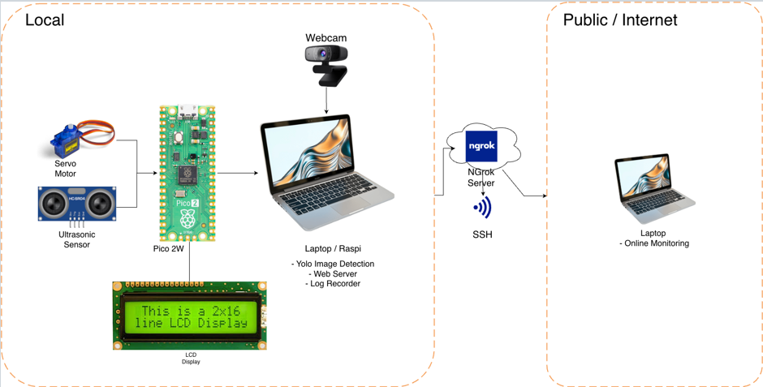
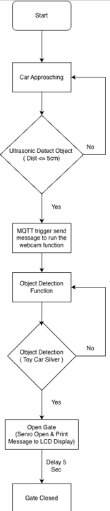

# Smart Parking Access Control System

An **Embedded System Final Project** that implements an intelligent parking gate system with computer vision capabilities for vehicle detection and automated access control.

## 🎯 Project Overview

This project creates a smart parking access control system that:
- Detects vehicles (specifically toy cars) using YOLOv8 computer vision
- Controls parking gate automatically via servo motor
- Streams real-time video monitoring through web interface
- Uses MQTT messaging for decentralized communication
- Integrates ultrasonic sensors for distance measurement

## 🖼️ Web Interface Preview


The web interface provides real-time monitoring with:
- Live video feed from the camera
- Real-time object detection with bounding boxes
- System status indicators (door status, detection confidence)
- Action log showing all system events
- Camera selection controls

## 📁 Project Structure

```
FinalEmbeddedSystem/
├── app.py                    # Main Flask web application with MJPEG streaming
├── CamClient.py             # TCP video stream client
├── test.py                  # MicroPython code for ESP32 (servo & ultrasonic sensor)
├── TestRequests.py          # HTTP request testing utility
├── requirements.txt         # Python dependencies
├── README.md                # Project documentation
├── Templates/
│   └── index.html          # Web interface template for monitoring
├── server/
│   ├── server.py            # Parking detection server (MQTT-based)
│   ├── requirements.txt     # Server dependencies
│   └── best.pt             # YOLOv8 trained model (5.5MB)
├── weights/
│   ├── best.pt             # YOLOv8 model file
│   ├── best(1).pt          # Backup model
│   └── last.pt             # Last training epoch model
├── mosquitto/
│   └── mosquitto.conf      # MQTT broker configuration
├── __pycache__/             # Python bytecode cache
└── FinalProjectWebView/    # Web view directory
```

## 🛠️ Technologies Used

### Backend
- **Python 3.11** - Primary programming language
- **Flask** - Web framework for HTTP server
- **OpenCV (cv2)** - Computer vision and video processing
- **YOLOv8 (ultralytics)** - Object detection model
- **Paho-MQTT** - MQTT client for messaging
- **Socket Programming** - TCP video streaming
- **Threading** - Concurrent processing

### Frontend
- **HTML5** - Web page structure
- **CSS3** - Styling and responsive layout
- **JavaScript** - Dynamic updates

### Hardware/Embedded
- **MicroPython** - For ESP32 microcontroller
- **Servo Motors** - Gate control mechanism
- **Ultrasonic Sensors** - Distance measurement

### Communication Protocols
- **MQTT** - Publish/subscribe messaging
- **TCP/IP** - Video streaming
- **HTTP/REST** - Web API endpoints

## 🔑 Key Features

1. **Real-time Vehicle Detection**
   - YOLOv8 model trained for "toy car" detection
   - Confidence threshold: 70%
   - Automated decision making for access control

2. **Video Streaming**
   - TCP-based video streaming (1080p @ 25fps)
   - MJPEG streaming for web interface
   - Efficient frame transmission over network

3. **Automated Gate Control**
   - Servo motor integration for gate mechanism
   - Ultrasonic sensor for distance measurement
   - Automated open/close based on vehicle detection

4. **Web Monitoring Dashboard**
   - Live video stream display
   - System status monitoring (door status, detection results)
   - Action log viewer
   - Camera selection interface

5. **MQTT Communication**
   - Decentralized messaging system
   - Real-time trigger notifications
   - Command publishing for control actions

## 📡 MQTT Topics

- `"parking/trigger"` - Vehicle detection triggers
- `"parking/cmd"` - Access control commands
- `"parking/status"` - System status updates

## 🚀 Getting Started

### Prerequisites

- Python 3.11+
- MQTT Broker (Mosquitto)
- ESP32 with MicroPython
- Camera module
- Servo motor
- Ultrasonic sensor

### Installation

1. **Install Python dependencies:**
   ```bash
   pip install -r requirements.txt
   ```

2. **Install server dependencies:**
   ```bash
   cd server
   pip install -r requirements.txt
   ```

3. **Configure MQTT Broker:**
   ```bash
   # Use the provided mosquitto.conf
   mosquitto -c mosquitto/mosquitto.conf
   ```

4. **Run the main application:**
   ```bash
   python app.py
   ```

5. **Run the detection server:**
   ```bash
   cd server
   python server.py
   ```

6. **Upload MicroPython code to ESP32:**
   ```bash
   # Use ampy or rshell to upload test.py to ESP32
   ```

## 📄 File Descriptions

### Core Application Files

- **[app.py](app.py)** - Main Flask web application
  - Provides MJPEG streaming (`/video_feed`)
  - Manages camera selection and video sources
  - Implements YOLOv8 inference for vehicle detection
  - Handles MQTT communication for access control
  - Provides REST APIs for status and system control

- **[CamClient.py](CamClient.py)** - Video stream client
  - Captures video from local camera (1080p@25fps)
  - Streams JPEG frames via TCP to server
  - Handles connection failures and reconnection

- **[server/server.py](server/server.py)** - Parking detection server
  - Receives MQTT triggers when vehicles are detected
  - Performs YOLOv8 inference on incoming frames
  - Makes access control decisions
  - Publishes commands to MQTT topics

### Hardware Integration

- **[test.py](test.py)** - MicroPython code for ESP32
  - Controls servo motor (gate mechanism)
  - Measures distance with ultrasonic sensor
  - Implements PWM for precise servo control

### Web Interface

- **[Templates/index.html](Templates/index.html)** - Real-time monitoring dashboard
  - Live video stream display
  - System status monitoring
  - Action log viewer
  - Camera selection interface

### Configuration

- **[mosquitto/mosquitto.conf](mosquitto/mosquitto.conf)** - MQTT broker settings
  - Listens on port 1883
  - Allows anonymous connections
  - Enables persistence for message history

## 🏗️ System Architecture

### Architecture Diagram



The system follows a distributed architecture with the following components:

1. **Video Capture Module**
   - Captures video from local camera or TCP stream
   - Processes frames for object detection
   - Streams MJPEG video to web interface

2. **Detection Server**
   - Receives MQTT triggers from external sensors
   - Performs YOLO inference on video frames
   - Makes access control decisions based on detection results
   - Publishes commands to control hardware

3. **MQTT Communication Layer**
   - Decentralized messaging between components
   - Topics: `parking/trigger`, `parking/cmd`, `parking/status`
   - Enables real-time event-driven architecture

4. **Web Interface**
   - Flask-based HTTP server providing REST APIs
   - Real-time video streaming via MJPEG
   - Dashboard for monitoring system status
   - Action log with reverse chronological order

5. **Hardware Control**
   - ESP32 microcontroller running MicroPython
   - Servo motor for gate actuation
   - Ultrasonic sensor for distance measurement
   - Receives commands via MQTT

### System Flow

```
Camera/MQTT Trigger → Detection Worker → YOLO Inference → Decision Making
                                                                ↓
                                        Web Dashboard ← MQTT → Hardware Control
```

## 📊 System Flowchart



### Detection Flow

1. **Trigger Received**
   - External sensor detects vehicle presence
   - MQTT trigger message sent to `parking/trigger` topic

2. **Frame Capture & Analysis**
   - System activates video stream
   - Captures multiple frames (configurable, default: 10 frames)
   - Runs YOLO inference on each frame

3. **Detection Decision**
   - **IF** target detected with confidence ≥ 70%:
     - Send OPEN command via MQTT
     - Update system status to "OPEN"
     - Record detection in log
     - Start 5-second cooldown before allowing close
   - **ELSE**:
     - Send DENIED status
     - Keep door closed
     - Log denial reason

4. **Cooldown Period**
   - After door opens, 5-second cooldown begins
   - Subsequent detections during cooldown delay door close
   - Prevents rapid open/close cycles

5. **Status Updates**
   - All events logged in reverse chronological order
   - Real-time status available via web API
   - Statistics tracked: total detections, access granted, denied

## 🎓 Course Information

- **Course:** Embedded System
- **Institution:** Taipei Tech
- **Semester:** S2 - 1st Semester
- **Project Type:** Final Project

## 📝 Notes

- YOLOv8 model is trained specifically for "toy car" detection
- Confidence threshold can be adjusted in the code
- The system supports multiple camera sources
- MQTT broker must be running before starting the application

## 🔧 Configuration

- **Model Path:** `server/best.pt`
- **Target Class:** "toy car"
- **Confidence Threshold:** 0.70 (70%)
- **MQTT Port:** 1883
- **Video Resolution:** 1920x1080 @ 25fps

---

**This project combines computer vision, IoT communication, web technologies, and hardware control to create an intelligent parking access solution.**
